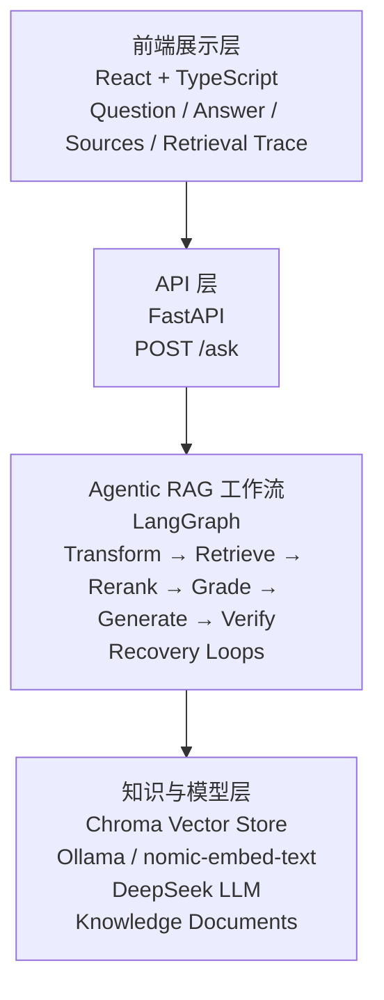
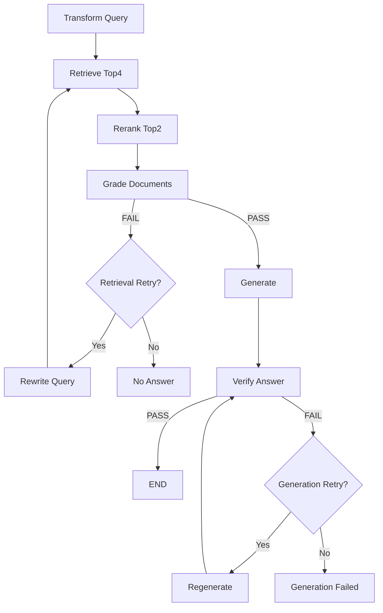

# Agentic RAG Assistant

一个基于 LangGraph 构建的可控 Agentic RAG 系统，包含 Query Transformation、Reranking、Document Grading、Answer Verification 以及有界恢复机制。

## 项目简介

Agentic RAG Assistant 是一个基于 LangGraph 搭建的 Agentic RAG 应用。

相比传统 RAG 的“检索 → 生成”流程，本项目在检索阶段加入 Query Transformation、Reranking 和 Document Grading，用于改善检索结果并判断当前资料是否足以回答用户问题；在生成阶段之后加入 Answer Verification，用于检查回答中的事实性内容是否受到检索资料支持。

当检索或生成阶段出现失败时，系统不会直接返回不可靠结果，也不会简单地从头重新执行整个流程，而是根据当前状态进入对应的有界恢复流程。

项目的核心设计思路是将 **语义判断** 与 **流程控制** 分离：

- LLM 负责需要自然语言理解的任务，包括 Query Transformation、Reranking、Grading、Generation 和 Verification。
- LangGraph 与 Python 负责确定性的流程控制，包括 State 管理、条件路由、重试次数和终止条件。

通过将 RAG 拆分为职责明确的节点，系统的执行过程可以被追踪，失败也可以定位到具体阶段，从而实现“运行时哪里失败修哪里，开发时哪里退化改哪里”。

## Demo

🎬 [观看 Agentic RAG Demo（Bilibili）](https://www.bilibili.com/video/BV138ht6LEuK/)

**1 分 43 秒 Demo**：展示 Agentic RAG 工作流、Success / Failure 两条实际执行路径，以及 Retrieval Evaluation。

Demo 主要包括：

- Query Transformation → Retrieve → Rerank → Grade → Generate → Verify 完整工作流
- 正常回答路径与 Sources / Retrieval Trace
- Grade 失败后的 Rewrite Query 与 Retrieval Recovery
- 知识不足时的 `No Answer` 机制
- 16 个固定 Regression Cases 的 Retrieval Evaluation

## 系统架构

项目整体分为四层：



### 前端展示层

使用 React + TypeScript 构建轻量级前端界面，负责接收用户问题，并展示最终回答、知识来源以及 Retrieval Trace。

### API 层

FastAPI 作为前端浏览器与 Python RAG 后端之间的 HTTP 接口层。

前端通过 `POST /ask` 提交用户问题，FastAPI 将 HTTP 请求转换为后端 RAG 调用，并将执行结果整理为 JSON 返回前端。

### Agentic RAG 工作流

使用 LangGraph 将整个 RAG 流程编排为一个带状态的工作流。

LLM 节点负责需要语义理解的任务，而 LangGraph State、Conditional Edge、Retry Counter 和终止条件负责确定性的流程控制，使系统能够根据不同执行结果进入不同分支和恢复路径。

### 知识与模型层

项目使用 Chroma 作为向量数据库，通过 Ollama 本地运行 `nomic-embed-text` 生成文档和 Query 的 Embedding。

DeepSeek 负责需要语义推理的任务，包括 Query Transformation、Reranking、Document Grading、Answer Generation 和 Answer Verification。

## RAG 工作流

传统 RAG 通常采用线性的：

```text
Retrieve → Generate
```

本项目将检索、判断、生成和验证拆分为独立节点，并通过 LangGraph 进行状态管理和条件路由：



整个工作流可以分为三个阶段：

### 1. 检索与筛选

用户问题首先经过 Query Transformation，将自然语言问题转换为更适合知识库检索的 Search Query。

随后使用 Embedding 从 Chroma 中召回 Top4 Candidate Chunks，再通过 LLM Reranker 根据用户的原始问题重新判断候选资料的相关程度，保留 Top2 作为最终上下文。

```text
Original Question
        ↓
Transform Query
        ↓
Vector Retrieve Top4
        ↓
LLM Rerank
        ↓
Top2 Documents
```

这里采用“向量召回 + LLM Rerank”的两阶段设计：

- Vector Retrieval 负责尽可能召回潜在相关资料；
- LLM Reranker 负责进一步理解问题与 Chunk 的语义关系，提高最终上下文的相关性。

### 2. 生成前后双重质量检查

Rerank 之后并不直接进入 Generate，而是先通过 Document Grading 判断最终资料是否足以回答用户问题。

```text
Rerank：哪些资料更相关？
Grade：这些资料是否足以回答问题？
```

“最相关”并不意味着“能够回答”。

即使知识库中不存在问题的答案，Vector Retrieval 和 Reranker 仍然可以从已有资料中排出最相关的几个 Chunk。因此 Grade 作为生成前的质量门，避免模型在资料不足时被迫生成答案。

资料通过 Grade 后进入 Generate。生成完成后，再通过 Answer Verification 检查回答中的事实性内容是否受到当前资料支持。

```text
Grade  → Context Quality Gate
Verify → Answer Quality Gate
```

即使资料本身足以回答问题，LLM 在生成过程中仍可能加入资料中不存在的信息，因此 Verification 用于进一步降低生成阶段的幻觉风险。

### 3. Failure-aware Recovery

系统没有将所有失败统一处理，而是根据失败发生的阶段进入不同的恢复路径。

当 Grade 失败时，当前检索资料被认为不足以回答问题，系统进入 Retrieval Recovery：

```text
Grade FAIL
    ↓
Rewrite Query
    ↓
Retrieve
    ↓
Rerank
    ↓
Grade
```

当 Verify 失败时，当前资料已经通过 Grade，因此 V1 优先将其视为 Generation Failure，不重新执行整个检索流程，而是根据 Verification Feedback 重新生成答案：

```text
Verify FAIL
     ↓
Regenerate
     ↓
Verify
```

这种设计遵循一个简单原则：

> **哪里失败，修哪里。**

相比任何节点失败后都从头执行整个 RAG Pipeline，局部恢复可以减少不必要的 LLM 调用，同时使失败原因和恢复路径更加清晰。

所有 Recovery Loop 都设置最大重试次数。当检索恢复仍然无法获得足够资料时，系统返回 `no_answer`；当生成结果多次无法通过 Verification 时，系统返回 `generation_failed`，从而保证工作流最终能够收敛和终止。

## 评估与测试

为了避免仅通过最终回答“看起来是否正确”来判断 RAG 效果，项目单独建立了 Retrieval Evaluation，用固定测试集评估检索链路，并记录 Candidate Rank、Hit@K 和 Rerank 后的结果。

评估的主要目的有两个：

1. 判断 Retrieval Pipeline 是否发生性能退化；
2. 当测试失败时，定位问题具体发生在哪个阶段。

### Retrieval Baseline

首先对 Vector Retrieval 建立 Baseline。

在当前 16 个固定 Regression Cases 上，直接使用向量检索 Top2 时：

```text
Vector-only Retrieval
Hit@2 = 9 / 16 = 56.2%
```

这意味着在 16 个测试问题中，有 9 个问题的预期 Chunk 能够直接进入向量检索 Top2。

通过分析失败 Case 的 Candidate Rank，可以进一步区分不同类型的问题，而不是只观察最终 Hit@2。

### Failure Diagnosis

对于一个检索失败的 Case，首先检查正确 Chunk 是否存在于 Candidate TopK 中：

```text
Expected Chunk 不在 Candidate TopK
        ↓
Recall Failure
        ↓
检查 Query / Chunking / Embedding / Candidate K
```

如果正确 Chunk 已经进入 Candidate TopK，但在 Rerank 后没有进入最终 TopN：

```text
Expected Chunk 在 Candidate TopK
        ↓
Rerank 后被淘汰
        ↓
Reranking Failure
        ↓
检查 Reranker
```

这种诊断方式使 Retrieval Evaluation 不只是输出一个最终分数，还可以帮助定位 Pipeline 中具体发生退化的阶段。

### Retrieval Pipeline Optimization

在 Baseline 基础上，项目逐步加入 Query Transformation 和 LLM Reranking：

```text
Original Question
        ↓
Query Transformation
        ↓
Vector Retrieval Top4
        ↓
LLM Reranking
        ↓
Final Top2
```

当前固定 16-case Regression Set 上的结果为：

| Retrieval Pipeline | Evaluation Result |
| --- | ---: |
| Vector-only Top2 | Hit@2 = 9/16（56.2%） |
| Transform + Vector Top4 + Rerank Top2 | Hit@2 = 16/16（100%） |

其中 Query Transformation 用于改善 Query 与知识库表达方式之间的差异，Vector Top4 提供更大的 Candidate Recall 空间，Reranker 再从候选资料中选择与原始问题最相关的 Top2。

### 如何理解 16/16

这里的 `16/16` **不代表系统检索准确率为 100%**。

它只表示：

```text
当前知识库
    +
固定的 16 个 Regression Cases
    ↓
完整 Retrieval Pipeline
    ↓
16 个 Case 的 Final Top2
均包含对应的预期 Chunk
```

由于测试集规模较小，而且测试内容与当前知识库相关，因此这个结果不能代表系统面对未知问题时具有 100% 的泛化能力。

这组测试的主要作用是作为 Regression Test：当后续修改 Chunking、Query Transformation、Embedding、Reranker 或其他 Retrieval 策略时，可以重新运行同一组 Case，判断检索能力是否发生退化，并进一步定位失败阶段。

### Workflow Validation

除了 Retrieval Evaluation，项目还对 LangGraph 的主要执行路径进行了验证，包括：

- 正常检索、生成与验证流程；
- Retrieval Failure → Rewrite Query → Retry；
- 知识库缺少答案 → `no_answer`；
- Verification Failure → Regenerate → Retry；
- Generation Retry 耗尽 → `generation_failed`；
- 最大重试次数与工作流终止；
- React → FastAPI → LangGraph 的端到端调用；
- FastAPI 不可用时的前端错误处理。

通过 Retrieval Evaluation 与 Workflow Validation 两部分测试，分别验证检索质量和工作流控制逻辑。

## 技术栈

| 模块 | 技术 | 作用 |
| --- | --- | --- |
| Workflow Orchestration | LangGraph | State 管理、节点编排、条件路由与 Recovery Loop |
| RAG Components | LangChain | Document、Text Splitter 等 RAG 基础组件 |
| Vector Store | Chroma | 存储文档 Embedding 并进行向量检索 |
| Embedding | Ollama + `nomic-embed-text` | 本地生成 Document / Query Embedding |
| LLM | DeepSeek | Query Transformation、Reranking、Grading、Generation、Verification |
| Backend API | FastAPI | 提供 `/ask` HTTP API，连接前端与 RAG Workflow |
| Frontend | React + TypeScript | 问答界面、Sources 与 Retrieval Trace 展示 |
| Build Tool | Vite | 前端开发与生产构建 |

## 本地运行

### 1. 克隆项目并进入目录

```powershell
git clone <repository-url>
cd rag-assistant
```

### 2. 创建 Python 虚拟环境

```powershell
python -m venv venv
.\venv\Scripts\Activate.ps1
```

### 3. 安装后端依赖

```powershell
pip install -r requirements.txt
```

### 4. 配置 DeepSeek API Key

在项目根目录创建 `.env`：

```text
DEEPSEEK_API_KEY=your_api_key
```

> `.env` 中包含 API Key，不应提交到 Git 仓库。

### 5. 准备本地 Embedding 模型

确保本机已经安装并启动 Ollama，然后准备 `nomic-embed-text`：

```powershell
ollama pull nomic-embed-text
```

可以通过下面的命令确认模型：

```powershell
ollama list
```

### 6. 构建知识库

项目知识文档位于 `data/` 目录。

运行：

```powershell
python ingest.py
```

该步骤会完成：

```text
Knowledge Documents
        ↓
Markdown-aware Split
        ↓
Recursive Chunking
        ↓
nomic-embed-text
        ↓
Chroma Vector Store
```

并在本地生成 `chroma_db/`。

### 7. 启动后端

```powershell
uvicorn api:app --reload
```

FastAPI 默认运行在：

http://127.0.0.1:8000

API 文档可以通过：

http://127.0.0.1:8000/docs

查看。

### 8. 启动前端

打开新的 PowerShell：

```powershell
cd frontend
npm install
npm run dev
```

Vite 开发服务器默认运行在：

http://localhost:5173

打开浏览器即可使用完整的 Agentic RAG Demo。

## 项目结构

```text
rag-assistant/
├── data/                   # RAG 知识文档
├── frontend/               # React + TypeScript 前端
├── ingest.py               # 文档解析、Chunking 与知识库构建
├── graph.py                # LangGraph Agentic RAG Workflow
├── main.py                 # RAG 调用入口 / CLI
├── api.py                  # FastAPI HTTP API
├── retrieval_test.py       # Retrieval 调试
├── retrieval_eval.py       # Retrieval Regression Evaluation
├── requirements.txt        # Python 直接依赖
├── .gitignore
├── README.md
├── chroma_db/              # 运行 ingest.py 后生成，不提交
└── .env                    # 本地创建，不提交
```

## 核心设计原则

本项目并不是简单地增加更多 LLM 调用，而是尝试建立明确的职责边界：

> **LLM 负责语义判断，Workflow 负责确定性控制。**

需要理解自然语言的任务交给 LLM，而 State、Branch、Retry 和 Termination 等流程控制交给 LangGraph 与 Python。

同时，系统尽量保持失败可定位和恢复路径明确：

> **运行时哪里失败修哪里，开发时哪里退化改哪里。**

通过这种方式，在保留 LLM 灵活性的同时，使整个 RAG Workflow 更加可控、可测试和可诊断。